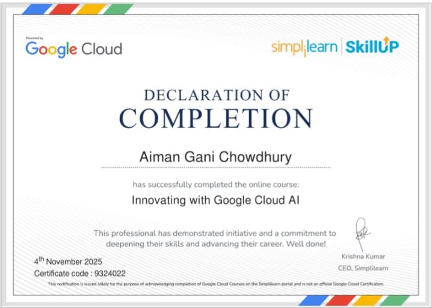
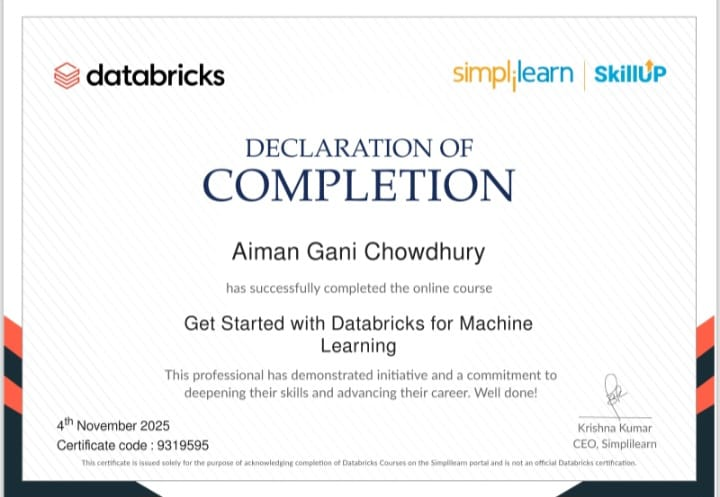
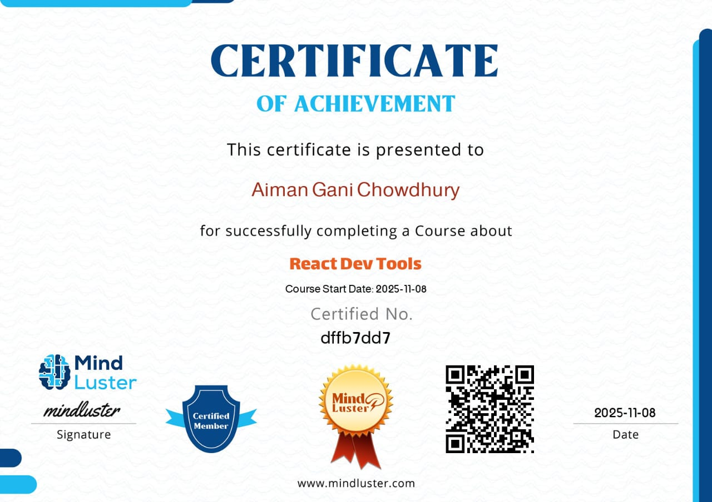
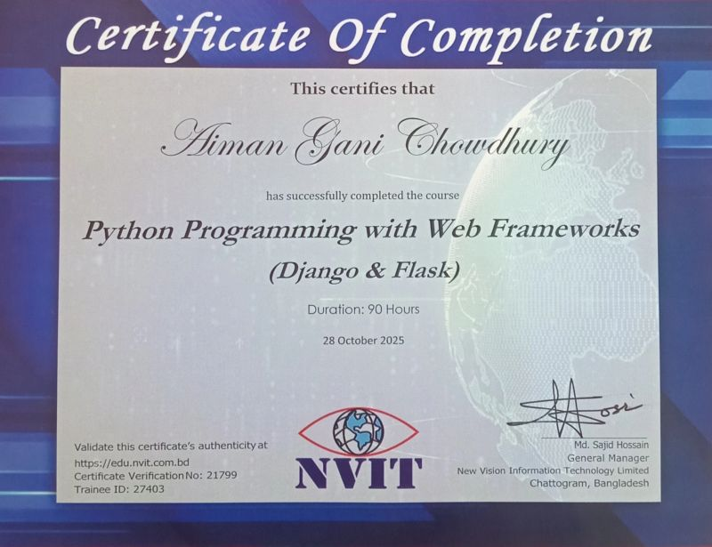
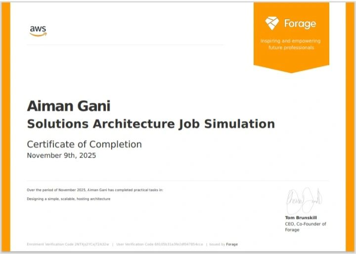

<h1 align="center">Hey there 👋, I’m Aiman</h1>

  <strong>Full-Stack Developer in Progress • CS Student • Tech Enthusiast</strong>

  I enjoy building web applications, exploring new technologies,
  and turning ideas into practical projects.

  💻 Web Development &nbsp; • &nbsp;
  ⚡ JavaScript &nbsp; • &nbsp;
  🐍 Python &nbsp; • &nbsp;
  ⚛️ React &nbsp; • &nbsp;
  🗄️ Databases

---

## 🚀 What I'm Up To

- 🔨 Building projects with **HTML, CSS, JavaScript & Python**
- ⚡ Strengthening my **JavaScript and frontend development** skills
- ⚛️ Currently learning **React**
- 🐍 Exploring **Django and backend development**
- 📊 Exploring **Power BI and data analytics**
- 🌐 Learning how to work with **APIs and databases**
- ☁️ Preparing to explore **AWS and Docker**
- 🧠 Continuously improving my **problem-solving and development skills**
- 🌱 Learning by **building, experimenting, and shipping projects**

---

## 💻 Tech Stack

### 🧠 Current Skills

### 🛠️ Currently Learning

### 🚀 Exploring Next

---

## 🚀 Featured Projects

### 🚤 Boga Robotics

**RoboBoat 2026 autonomous surface vehicle project website**

- HTML
- CSS
- JavaScript
- Three.js
- Interactive 3D experience

🔗 [GitHub Repository](https://github.com/Aiman54321/boga-robotics)  
🌐 [Live Demo](https://aiman54321.github.io/boga-robotics/)

---

### 🎬 Netflix Clone

A Netflix-inspired streaming interface created to practice frontend development and interactive UI design.

- HTML
- CSS
- JavaScript
- Responsive design
- Interactive UI

🔗 [GitHub Repository](https://github.com/Aiman54321/netflix-clone)  
🌐 [Live Demo](https://aiman54321.github.io/netflix-clone/)

---

### 🛒 Amazon Clone

A frontend recreation of an Amazon-style shopping interface built to practice layouts, styling, and responsive design.

- HTML
- CSS
- Responsive layout
- UI development

🔗 [GitHub Repository](https://github.com/Aiman54321/Amazon-clone-project)  
🌐 [Live Demo](https://aiman54321.github.io/Amazon-clone-project/)

---

### ✊ Rock Paper Scissors

An interactive browser game featuring game logic, score tracking, and persistent data.

- HTML
- CSS
- JavaScript
- LocalStorage
- Game logic

🔗 [GitHub Repository](https://github.com/Aiman54321/rock-paper-scissors)  
🌐 [Live Demo](https://aiman54321.github.io/rock-paper-scissors/)

---

### 📝 Daily To-Do List

A responsive task management application built with vanilla JavaScript and browser storage.

- HTML
- CSS
- JavaScript
- DOM manipulation
- LocalStorage
- Task management

🔗 [GitHub Repository](https://github.com/Aiman54321/daily-todo-list)

---

### 🔐 JavaScript Authentication Demo

A frontend authentication project demonstrating registration, login, validation, session handling, and protected page flow.

- HTML
- CSS
- JavaScript
- Form validation
- Authentication flow
- LocalStorage

> ⚠️ This project is a frontend learning demonstration and is not intended to represent production-grade authentication.

🔗 [GitHub Repository](YOUR-AUTHENTICATION-REPOSITORY-LINK)

---

## 🧪 Other Projects

| Project | Technologies | Demo |
|---|---|---|
| 🧮 Calculator | HTML, CSS, JavaScript | [Live Demo](https://aiman54321.github.io/calculator/) |
| 👻 Ghost Buster | HTML, CSS | [Live Demo](https://aiman54321.github.io/ghost-buster/) |
| 🌀 CSS Spinner | HTML, CSS | [Live Demo](https://aiman54321.github.io/css-spinner/) |

---

## ⚙️ Tools

---

## 📈 GitHub Activity

  

  

  

---

## 🏆 Certifications

### 🎓 Innovating with Google Cloud AI

**Issued by:** Google Cloud & Simplilearn  
**Date:** 4th November 2025

---

### 🎓 Get Started with Databricks for Machine Learning

**Issued by:** Databricks & Simplilearn  
**Date:** 4th November 2025

---

### 🎓 React Dev Tools

**Issued by:** MindLuster  
**Date:** 8th November 2025

---

### 🎓 Python Programming with Web Frameworks

**Django & Flask**

**Issued by:** New Vision Information Technology Limited (NVIT)  
**Duration:** 90 Hours  
**Date:** 28th October 2025

---

### 🎓 AWS Solutions Architecture Job Simulation

**Issued by:** AWS & Forage  
**Date:** 9th November 2025

---

## 📫 Let's Connect

---

> **Code. Learn. Build. Repeat.**
